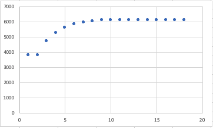
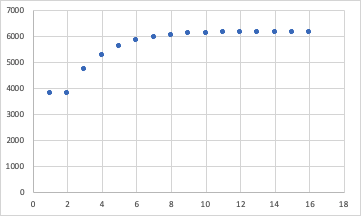

# QuickSort
***
### This document is about CPE593 optional homework
***Yupeng Cao***

## Homework Description
Write a golden mean search to find the best k value for your \Knuth-optimized partial quicksort.

## Code
KunthQuickSort.cpp

## Result
Kunth QuickSort Result

  
