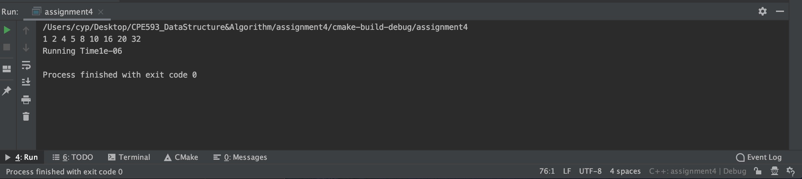

# QuickSort
***
### This document is about CPE593 optional homework
***Yupeng Cao***

## Homework Description
Write a golden mean search to find the best k value for your \Knuth-optimized partial quicksort.

## Result
Kunth QuickSort Result

Benchmark: Original QuickSort Result

## Discussion
The two figures show that the running time of Kunth_Quicksort is 4e-05 and Quicksort is 1e-06, where the result means that Time(Kunth) > Time(QuickSort). However, the expected output is that Time(Kunth) < Time(QuickSort). 

Thus, we analysis the code and check the each component in code (Golden Mean Search, Insertion Sort, Quick Sort), but each part is worked. After analysing, we purpose two possible reasons to cause this problem:

* The size of input array is too small. In my homework, it just include nine elements. For a small size, quicksort.cpp just call one function to run program, but kunth method will call more function to implement program. Therefore, we should try to use code to randomly generate array.

* The perplexity of input array is not enough. 

We still try to figure out the problem in this homework. Looking the two figures. 

  
